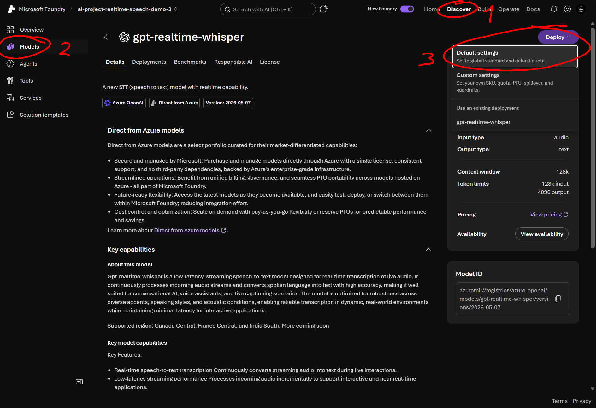
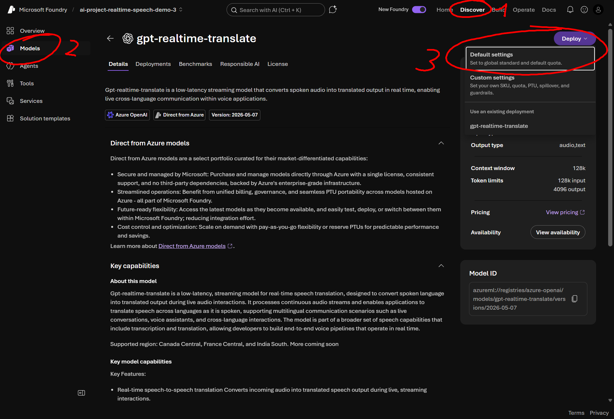

# transcribing and translating in realtime with ai

not so long ago, openai released [a realtime model for transcription and translation](https://openai.com/index/advancing-voice-intelligence-with-new-models-in-the-api/), which was almost [immediately also available for azure](https://techcommunity.microsoft.com/blog/azure-ai-foundry-blog/a-new-chapter-for-realtime-ai-reasoning-translation-and-real-time-transcription/4517124), when i wanted to try it, i couldn't figure out how. i wish there was some kind of clear usage documentation on these specialized models for using it through microsoft foundry (azure).

now there is, this is a practical guide on how to use gpt-realtime-whisper and gpt-realtime-translate on microsoft foundry.

i'll start with gpt-realtime-whisper because it's the basis of gpt-realtime-translate

some essential pre-reqs:

- create a foundry resource and project in `france-central` on your azure account.
- you must have `Cognitive Services OpenAI User` role assignment on the foundry resource.

## gpt-realtime-whisper

this model enables real-time transcription and caption generation. imagine watching a video without captions. this model lets you generate live captions in any language, with the ability to switch languages on the fly and accurately transcribe audio as it plays.

that's cool, but how do you use it?

here's the repo if you just want to give this link to an agent and find out yourself: https://github.com/aryxenv/azure-gpt-realtime-whisper-translate/tree/main/raw

or if you trust a human more (me), you can continue reading

### usage

open the `setup gpt-realtime-whisper and project` details if you want to start from scratch

<details>
<summary>setup gpt-realtime-whisper and project</summary>

1. deploy the model `gpt-realtime-whisper` on foundry, deployment name ideally matches the model name.

   

2. create a project folder locally, name doesn't matter

3. create a `.env` file and change the `AZURE_OPENAI_RESOURCE_NAME` value to your actual resource name

   ```env
   AZURE_OPENAI_RESOURCE_NAME=<your-resource-name> # not the whole url, just the resource name
   AZURE_OPENAI_REALTIME_DEPLOYMENT=gpt-realtime-whisper # change this if u gave deployment another name
   ```

4. hopefully you have [python](https://www.python.org/downloads/) and [uv](https://docs.astral.sh/uv/getting-started/installation/)

   ```pwsh
   uv init
   uv venv
   uv add aiohttp azure-identity python-dotenv sounddevice websockets
   ```

5. create a file called like `gpt_realtime_whisper.py` and drop in these imports

   ```py
   # standard ones
   import asyncio
   import base64
   import json
   import math
   import os
   import struct

   import sounddevice as sd # audio capture
   from azure.identity.aio import DefaultAzureCredential # auth
   from websockets.asyncio.client import connect # websockets
   from dotenv import load_dotenv # env
   ```

6. add the configs

   ```py
   load_dotenv() # this brings in the env variables u added in step 3

   RESOURCE = os.environ["AZURE_OPENAI_RESOURCE_NAME"]
   DEPLOYMENT = os.environ["AZURE_OPENAI_REALTIME_DEPLOYMENT"]

   URL = f"wss://{RESOURCE}.openai.azure.com/openai/v1/realtime?intent=transcription" # this is the websocket endpoint for transcribing on Azure OpenAI

   # audio config
   SAMPLE_RATE = 24000
   CHUNK_SAMPLES = 2400  # 100 ms

   # turn detection not supported, so we handle turn detection manually
   SPEECH_RMS = 0.01  # anything quieter counts as silence
   SILENT_CHUNKS_TO_COMMIT = 9  # 900 ms of quiet ends an utterance
   MIN_CHUNKS_TO_COMMIT = 5  # azure rejects buffers shorter than ~500 ms
   ```

7. python main wrap in which u write the code

   ```py
   async def main():
       # code here

   try:
       asyncio.run(main())
   except KeyboardInterrupt:
       print("\nStopped.")
   ```

</details><br>

a simple python console app for gpt-realtime-whisper, see the exact steps taken in the code

> [!IMPORTANT]
> steps 5 to 7 in `setup gpt-realtime-whisper and project` dropdown above contain some code that is required for this to work, just copying and pasting won't immediately work.

```py
# 1. Get a bearer token for Azure OpenAI.
credential = DefaultAzureCredential()
token = await credential.get_token("https://cognitiveservices.azure.com/.default")

# 2. Open the realtime websocket.
ws = await connect(
    URL,
    additional_headers={"Authorization": f"Bearer {token.token}"},
    max_size=None,
)

# 3. Configure the transcription session. gpt-realtime-whisper does not support turn_detection, so we find utterance boundaries ourselves and commit the buffer manually.
await ws.send(
    json.dumps(
        {
            "type": "session.update",
            "session": {
                "type": "transcription",
                "audio": {
                    "input": {
                        "format": {"type": "audio/pcm", "rate": SAMPLE_RATE},
                        "transcription": {"model": DEPLOYMENT},
                    },
                },
            },
        }
    )
)

# 4. Mic capture. The sounddevice callback runs on its own thread, so it hands raw PCM16 bytes to asyncio through this queue.
loop = asyncio.get_running_loop()
mic_queue = asyncio.Queue()

def on_audio(indata, frames, time, status):
    loop.call_soon_threadsafe(mic_queue.put_nowait, bytes(indata))

stream = sd.RawInputStream(
    samplerate=SAMPLE_RATE,
    blocksize=CHUNK_SAMPLES,
    channels=1,
    dtype="int16",
    callback=on_audio,
)
stream.start()
print("Listening... press Ctrl+C to stop.\n")

# 5. Pump mic audio up to Azure, and commit the buffer once the talking stops.
async def send_audio():
    buffered_chunks = 0
    silent_chunks = 0
    heard_speech = False

    while True:
        chunk = await mic_queue.get()
        await ws.send(
            json.dumps(
                {
                    "type": "input_audio_buffer.append",
                    "audio": base64.b64encode(chunk).decode("ascii"),
                }
            )
        )
        buffered_chunks += 1

        # Loudness of this chunk, 0.0 (silence) to 1.0 (clipping).
        samples = struct.unpack(f"<{len(chunk) // 2}h", chunk)
        rms = math.sqrt(sum(s * s for s in samples) / len(samples)) / 32768

        if rms >= SPEECH_RMS:
            heard_speech = True
            silent_chunks = 0
        else:
            silent_chunks += 1

        if (
            heard_speech
            and silent_chunks >= SILENT_CHUNKS_TO_COMMIT
            and buffered_chunks >= MIN_CHUNKS_TO_COMMIT
        ):
            await ws.send(json.dumps({"type": "input_audio_buffer.commit"}))
            buffered_chunks = 0
            silent_chunks = 0
            heard_speech = False

# 6. Print transcripts as they come back.
async def receive_transcripts():
    async for message in ws:
        event = json.loads(message)
        kind = event["type"]

        if kind == "conversation.item.input_audio_transcription.delta":
            print(event["delta"], end="", flush=True)
        elif kind == "conversation.item.input_audio_transcription.completed":
            print(f"\n--- {event['transcript']}\n")
        elif kind == "error":
            # filter out "buffer too small". just means we committed when Azure had nothing pending.
            message = event["error"]["message"]
            if "buffer too small" not in message.lower():
                print(f"\n[error] {message}\n")

sender = asyncio.create_task(send_audio())
receiver = asyncio.create_task(receive_transcripts())

try:
    await asyncio.gather(sender, receiver)
finally:
    stream.stop()
    stream.close()
    await ws.close()
    await credential.close()
```

that's it, now just run it, talk and see live transcriptions being generated

```pwsh
uv run gpt_realtime_whisper.py
```

this is what you can expect as output

> Listening... press Ctrl+C to stop.
>
> So this is running live on Azure?
> --- So this is running live on Azure?
>
> And now I'm going to switch
> --- And now I'm going to switch
>
> Nu ga ik verder in het Nederlands en het model moet dit gewoon oppikken.
> --- Nu ga ik verder in het Nederlands en het model moet dit gewoon oppikken.
>
> Zonder dat ik iets verander in de configuratie.
> --- Zonder dat ik iets verander in de configuratie.
>
> Okay, back to English
> --- Okay, back to English
>
> Stopped.

## gpt-realtime-translate

if we take it a step further from just realtime multi-lingual transcriptions, we can even translate it in realtime, so not only do you have accurate multi-lingual transcriptions, but the translation of it too in the language of your choice with `gpt-realtime-translate`. this model lets us have realtime multi-lingual **translations** (+ optionally transcriptions included).

again, here's the repo if you just want to give this link to an agent and find out yourself: https://github.com/aryxenv/azure-gpt-realtime-whisper-translate/tree/main/raw

otherwise here's my guide;

### usage

i will still leave some details for getting set up

> [!NOTE]
> in this guide i'll be using the existing deployment of `gpt-realtime-whisper` for input transcriptions, which is optional if you only need translations.

<details>
<summary>setup gpt-realtime-translate and project</summary>

1. deploy the model `gpt-realtime-translate` on foundry, deployment name ideally matches the model name.

   

2. create a project folder locally, name doesn't matter

3. create a `.env` file and change the `AZURE_OPENAI_RESOURCE_NAME` value to your actual resource name

   ```env
   AZURE_OPENAI_RESOURCE_NAME=<your-resource-name> # not the whole url, just the resource name
   AZURE_OPENAI_REALTIME_TRANSLATION_MODEL=gpt-realtime-translate # despite confusing name, put deployment name here not model name. change this if u gave deployment another name
   AZURE_OPENAI_REALTIME_DEPLOYMENT=gpt-realtime-whisper # optional, for input transcriptions
   ```

4. hopefully you have [python](https://www.python.org/downloads/) and [uv](https://docs.astral.sh/uv/getting-started/installation/)

   ```pwsh
   uv init
   uv venv
   uv add aiohttp azure-identity python-dotenv sounddevice websockets
   ```

5. create a file called like `gpt_realtime_translate.py` and drop in these imports

   ```py
   # standard ones
   import asyncio
   import base64
   import json
   import os

   import sounddevice as sd # audio capture
   from azure.identity.aio import DefaultAzureCredential # auth
   from websockets.asyncio.client import connect # websockets
   from dotenv import load_dotenv # env
   ```

6. add the configs

   ```py
   load_dotenv() # this brings in the env variables u added in step 3

   RESOURCE = os.environ["AZURE_OPENAI_RESOURCE_NAME"]
   MODEL = os.environ["AZURE_OPENAI_REALTIME_TRANSLATION_MODEL"]
   DEPLOYMENT = os.environ["AZURE_OPENAI_REALTIME_DEPLOYMENT"] # not needed if you don't want input transcriptions

   URL = f"wss://{RESOURCE}.openai.azure.com/openai/v1/realtime/translations?model={MODEL}" # this is the websocket endpoint for translating on Azure OpenAI

   TARGET_LANGUAGE = "fr"  # change language here if u want

   # audio config, turn detection is supported here unlike gpt-realtime-whisper
   SAMPLE_RATE = 24000
   CHUNK_SAMPLES = 2400  # 100 ms
   ```

7. python main wrap in which u write the code

   ```py
   async def main():
       # code here

   try:
       asyncio.run(main())
   except KeyboardInterrupt:
       print("\nStopped.")
   ```

</details><br>

a simple python console app for gpt-realtime-translate, see the exact steps taken in the code

> [!IMPORTANT]
> steps 5 to 7 in `setup gpt-realtime-translate and project` dropdown above contain some code that is required for this to work, just copying and pasting won't immediately work.

```py
# 1. Get a bearer token for Azure OpenAI.
credential = DefaultAzureCredential()
token = await credential.get_token("https://cognitiveservices.azure.com/.default")

# 2. Open the realtime translations websocket. The openai-alpha header opts into the translation API.
ws = await connect(
    URL,
    additional_headers={
        "Authorization": f"Bearer {token.token}",
        "openai-alpha": "translation=v1",
    },
    max_size=None,
)

# 3. Configure the translation session. The translation endpoint finds utterance boundaries itself, so there is no turn detection or audio commit to configure.
await ws.send(
    json.dumps(
        {
            "type": "session.update",
            "session": {
                "audio": {
                    "input": {
                        "transcription": {"model": DEPLOYMENT}, # remove the entire "input" thing if you don't want input transcriptions (note that if you remove this, you will need to modify multiple pieces of code from this sample to not handle input transcriptions logic)
                    },
                    "output": {
                        "language": TARGET_LANGUAGE,
                    },
                },
            },
        }
    )
)

# 4. Mic capture. The sounddevice callback runs on its own thread, so it hands raw PCM16 bytes to asyncio through this queue.
loop = asyncio.get_running_loop()
mic_queue = asyncio.Queue()

def on_audio(indata, frames, time, status):
    loop.call_soon_threadsafe(mic_queue.put_nowait, bytes(indata))

stream = sd.RawInputStream(
    samplerate=SAMPLE_RATE,
    blocksize=CHUNK_SAMPLES,
    channels=1,
    dtype="int16",
    callback=on_audio,
)
stream.start()
print("Listening... press Ctrl+C to stop.\n")

# 5. Pump mic audio up to Azure.
async def send_audio():
    while True:
        chunk = await mic_queue.get()
        await ws.send(
            json.dumps(
                {
                    "type": "session.input_audio_buffer.append",
                    "audio": base64.b64encode(chunk).decode("ascii"),
                }
            )
        )

# 6. Print the translation live. Keep the source transcript for the summary at exit.
transcript = []
pending = ""  # this is used to track input transcript until the end

async def receive_translations():
    nonlocal pending

    async for message in ws:
        event = json.loads(message)
        kind = event["type"]

        if kind == "session.output_transcript.delta":
            print(event["delta"], end="", flush=True)
        elif kind in (
            "session.output_transcript.completed",
            "session.output_transcript.done",
        ):
            print()
        elif kind == "session.input_transcript.delta":
            pending += event["delta"]
        elif kind in (
            "session.input_transcript.completed",
            "session.input_transcript.done",
        ):
            transcript.append(event.get("transcript") or pending)
            pending = ""
        elif kind == "error":
            print(f"\n[error] {event['error']['message']}\n")

sender = asyncio.create_task(send_audio())
receiver = asyncio.create_task(receive_translations())

try:
    await asyncio.gather(sender, receiver)
finally:
    stream.stop()
    stream.close()
    await ws.close()
    await credential.close()

    if pending:
        transcript.append(pending)

    print("\n\n--- what you said ---")
    for line in transcript:
        print(line)
```

that's it, now just run it, talk and see live translations being generated, if you exit it will show you the transcription it picked up as well

```pwsh
uv run gpt_realtime_translate.py
```

this is the output you can expect

> Listening... press Ctrl+C to stop.
>
> Donc, ça tourne en direct sur Azure, et maintenant, je vais changer. Alors, je poursuis en
> néerlandais,et le modèledoit simplement le captersans que je change quoi que ce soit dans la
> configuration. OK, je repasse à l’anglais.
>
> --- what you said ---
> So this is running live on Azure and now I'm going to switch. Nu ga ik verder in het
> Nederlands. En het model moetdit gewoon oppikken, zonder dat ik iets verander in de
> configuratie. Oké, back to English
>
> Stopped.

## pros and cons

### pros

- real-time transcription and translation
- multilingual support with live language switching
- llm-based for accurate understanding
- seamless azure integration through foundry

### cons

- likely overkill when you just need quick local transcriptions in realtime, in that case [nemotron-asr-streaming](https://build.nvidia.com/nvidia/nemotron-asr-streaming/modelcard) would be better suited. (languages support and accuracy lower than gpt-realtime-whisper)
- limited deployment region options
- manual turn detection needed for `gpt-realtime-whisper`
- no support for `delay` parameter in transcription context payload through azure

## references

- [sample repo for this guide (slide-ready deck)](https://github.com/aryxenv/azure-gpt-realtime-whisper-translate)
- [sample code only to see raw usage of models](https://github.com/aryxenv/azure-gpt-realtime-whisper-translate/tree/main/raw)
- [openai — advancing voice intelligence with new models in the api](https://openai.com/index/advancing-voice-intelligence-with-new-models-in-the-api/)
- [azure ai foundry blog, a new chapter for realtime ai](https://techcommunity.microsoft.com/blog/azure-ai-foundry-blog/a-new-chapter-for-realtime-ai-reasoning-translation-and-real-time-transcription/4517124)
- [azure openai realtime audio quickstart](https://learn.microsoft.com/azure/ai-foundry/openai/realtime-audio-quickstart)
- [azure openai model availability by region](https://learn.microsoft.com/azure/ai-foundry/openai/concepts/models)
- [openai realtime transcription guide](https://platform.openai.com/docs/guides/realtime-transcription)
- [python](https://www.python.org/downloads/)
- [uv](https://docs.astral.sh/uv/getting-started/installation/)
- [sounddevice](https://python-sounddevice.readthedocs.io/)
- [websockets](https://websockets.readthedocs.io/)
- [nvidia nemotron-asr-streaming](https://build.nvidia.com/nvidia/nemotron-asr-streaming/modelcard)
