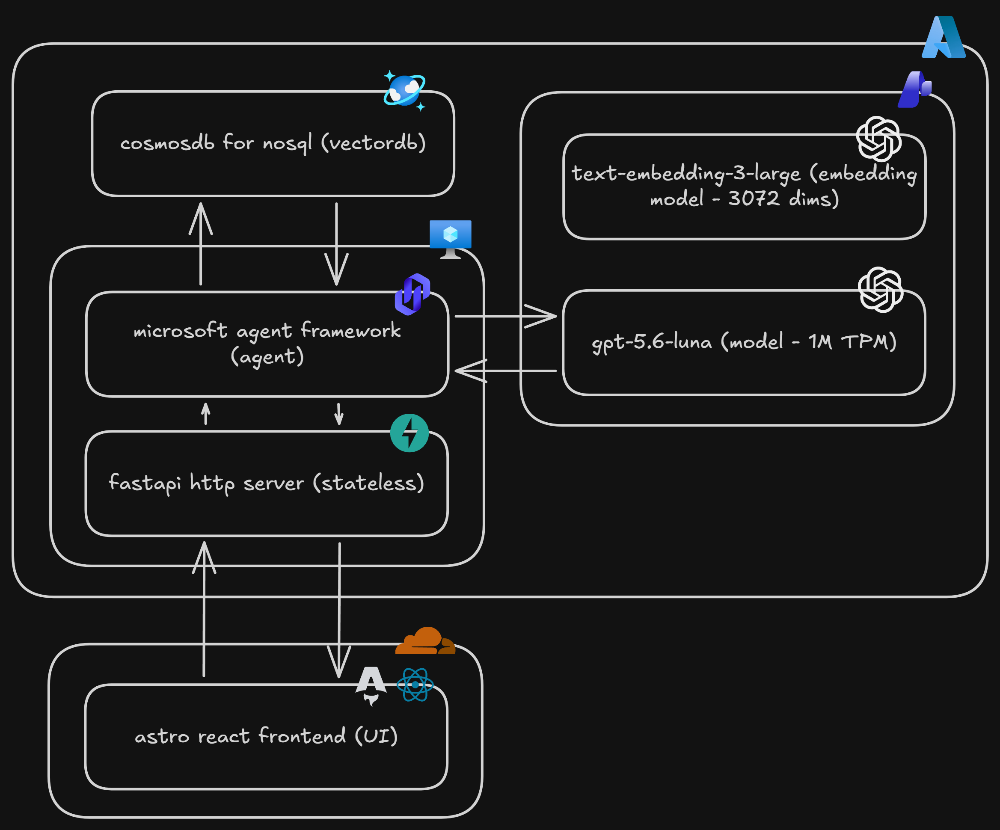

# how i deployed an ai agent on my portfolio without going broke

yes, you read that right. ai inference and cloud deployments usually burn a hole in your wallet, so how can this stack run for pennies? it all comes down to how each layer is structured on azure, especially if you have access to the $100 student credit.

## high level overview

since the setup consists of multiple layers, let me break it down.

1. **frontend**: the portfolio site where the agent will be exposed on
2. **backend**: the backend that will run the agent and http requests to call the agent
3. **database**: the vector database (+ embedding model) for storing relevant context for the agent to use as knowledge using rag.
4. **agent**: the agent itself which runs on the backend server
5. **github actions**: ci/cd to automate incremental indexing on content changes and automated frontend & backend deployments

thats it, each component is either free or costs pennies.

^ somewhat simplified

## the frontend

this will not be a core focus, but the frontend is hosted on cloudflare pages which is free up to 100k requests daily, which is usually more than enough for a personal portfolio site. you can also use your custom domain on this if you have one (in my case `aryxenv.dev` is hooked up to it).

## the backend

this is where the azure student subscription helps a lot. instead of paying for a container app, or app service plan, or a vm, with azure student sub you get multiple vms for free. in this case i went for a **B1s vm which has 1gb ram and 1vcpu**, enough for an orchestration layer and http requests, the vm itself is free.

> [!NOTE]
> you may be charged extra for storage, networking, and other add-ons. nonetheless, you have a 100$ credit budget so even if it spills over you have a safety net.

## the database

this is fully free, even if you don't have a student subscription. you can go for the free tier on azure ai search which gives you 50 mb of storage, if your content is small enough this should be enough. however if you expect the content to grow and dont want to deal with migrations later on, go with **cosmosdb for nosql**, like i did. on your azure subscription, you can create 1 free cosmosdb account with 25gb of storage and 1000 ru per second. to put it in vector terms:

- 50 mb (ai search): approx. 8000 vectors @ 1536 dims (float32, excluding metadata and index overhead)
- 25 gb (cosmosdb for nosql): approx. 4000000 vectors @ 1536 dims (float32, excluding metadata and index overhead)

each 1536-dimensional float32 vector uses 6144 bytes before metadata and indexing overhead, so actual capacity will be lower.

but the point is, you will never have to worry about storage with cosmosdb for your portfolio site. and since storage wasnt going to be a problem i went with 3072 dims as vector size with `text-embedding-3-large` for embeddings.

## the agent

this is the most fun part, but also the part i have the most to "complain" about. i'm using microsoft agent framework, which is an open-source agent orchestration framework. it's also tightly integrated with microsoft foundry which im using for the model which is gpt-5.6-luna.

initially i wanted to go with [Groq API](https://groq.com/), because this is free on certain models and incredibly fast. unfortunately they limited the free model selection to only `groq/compound` and `groq/compound-mini`, both of which work with microsoft agent framework, but don't allow custom tool usage.

the next best option was to use the 100$ azure credit to use a **model on microsoft foundry**, here the cheapest and quite powerful model was `deepseek-v4-flash`, this was incredibly fast, and extremely smart at tool usage, which makes sense as it's advertised as a model for agents. small problem though, microsoft has set a 20 requests per minute (RPM) limit on this model. this is absurd in my opinion, for a model where 90% of the calls are low token tool calls, it burns through the limit extremely fast, i mean in the single digits of user requests.

imagine this: im a user that asks a question about one of the projects listed on the portfolio, the agent goes ahead and uses tool calls to find the relevant context through rag with multiple tool calls to get the complete info. let's say **5 tool calls were made to fulfill this user question**. since the limit is 20 RPM, 3 more users can ask questions in that same minute. but if theres 5 users? well now you have a problem because the **5th user will be rate limited and get a 429 error**. this is a huge bottleneck for agents since agents are built to call tools often, hence make requests often as well.

how did i get past this bottleneck? simply switch to `gpt-5.6-luna`, which is a model that is not rate limited on requests, same speed and performance of `deepseek-v4-flash` (if not better), and has a token per minute limit of a million, it's safe to say the limit will not be hit (ever, for a portfolio site). a trade-off had to be made though, the model is more than **twice as expensive on output token cost**, but since it has no rate limit, it can handle multiple users at once without any issues, and relatively the cost is acceptable compared to other options.

in the end switching to `gpt-5.6-luna` was an incredibly good choice, because it's so fast and efficiently makes tool calls. my portfolio agent is able to **answer questions in less than 2 seconds on average** which is quite impressive for a near-free setup.

## github actions

im using github actions for ci/cd to automate **incremental indexing on content changes** and **automated frontend & backend deployments**. this means that instead of manually updating the vectordb with new content or content updates, the ci/cd pipeline will do it for me automatically and efficiently by only processing what has changed.

for the app layer, the frontend ci/cd comes from cloudflare pages directly, and the backend ci/cd is also automated to redeploy the server on the azure vm when changes are made in the server code.

we can say this is free because if ur a github free user, you get **free 2000 minutes of github actions per month**, which is more than enough since our actions take less than a minute to run each.

## total costs

lets make a rough calculation of the **monthly costs** for this setup, assuming real numbers i see on my portfolio site:

> [!NOTE]
> backend is basically a server for the agent, so the requests will be identical.

| Component          | Usage                                      | Cost                                         | Notes                                                                                                                                                  |
| ------------------ | ------------------------------------------ | -------------------------------------------- | ------------------------------------------------------------------------------------------------------------------------------------------------------ |
| **frontend**       | 60k requests                               | **free**                                     | Cloudflare Pages stays under the 100k daily limit (about 2k requests per day).                                                                         |
| **backend**        | 600 requests (1% of 60k)                   | **free** + ~**$5/month**                     | Free on Azure VM with the B1s student discount; minor storage and networking costs apply.                                                              |
| **agent**          | 600 requests (1% of 60k)                   | **$1.176/month**                             | At $0.20 in / $1.20 out per 1M tokens, each request uses ~1k tokens and 3 model calls per user request, totaling ~1.8M tokens and ~**$1.176** monthly. |
| **database**       | 1200 requests (2 queries per user request) | **no cost**                                  | Plenty of RU capacity and storage remain on the free tier of Cosmos DB.                                                                                |
| **github actions** | Incremental indexing and deployments       | **free**                                     | github free plan includes 2000 actions minutes per month, which is more than enough for these workflows.                                               |
| **total**          | 60k requests                               | **$6.176/month** (0\$ with student discount) | Total cost for the portfolio site with AI agent.                                                                                                       |

the total comes down to a monthly cost of **6.176$** for 60k requests on the portfolio site, which is a very reasonable cost for a personal portfolio site with an ai agent. with an azure student subscription, youre effectively paying **0$** because the costs are covered by the 100% credit. if you have no other projects that use up credit, you pay 0$ for the whole year since the credit is 100$ and the total **cost for the year is 74.112$ (6.176$ \* 12 months)**. if you have other projects that use up credit, then you will be paying for this setup, but it will still be very cheap.

in my case i also have a custom domain which i bought for like 6$ a year. but this is optional.

if you're interested in copying the setup for your own portfolio site, if so, i open-sourced my entire portfolio and you can find it here: https://github.com/aryxenv/Portfolio

or if you want to play around with the agent, ask a question on the bottom input box you see of this page. try: **"How does this portfolio agent work?"** and see how the agent responds. you can also ask questions about my projects, or my bio, or anything else on the portfolio site.

## references

- [portfolio repository (full source code)](https://github.com/aryxenv/Portfolio)
- [azure for students - free cloud services & $100 credit](https://azure.microsoft.com/free/students/)
- [cloudflare pages documentation](https://developers.cloudflare.com/pages/)
- [azure b-series burstable virtual machine specifications](https://learn.microsoft.com/azure/virtual-machines/sizes/b-series-burstable)
- [azure cosmos db lifetime free tier](https://learn.microsoft.com/azure/cosmos-db/free-tier)
- [azure cosmos db nosql vector search](https://learn.microsoft.com/azure/cosmos-db/nosql/vector-search)
- [azure ai search limits and quotas](https://learn.microsoft.com/azure/search/search-limits-quotas-capacity)
- [azure openai service embedding models](https://learn.microsoft.com/azure/ai-foundry/openai/concepts/models#embeddings)
- [microsoft agent framework](https://github.com/microsoft/agent-framework)
- [github actions billing - included actions minutes](https://docs.github.com/en/billing/managing-billing-for-your-products/managing-billing-for-github-actions/about-billing-for-github-actions)
- [azure ai foundry overview & documentation](https://learn.microsoft.com/azure/ai-foundry/)
- [azure openai service quotas & rate limits](https://learn.microsoft.com/azure/ai-foundry/openai/how-to/quota)
- [groq api & supported models](https://console.groq.com/docs/models)
