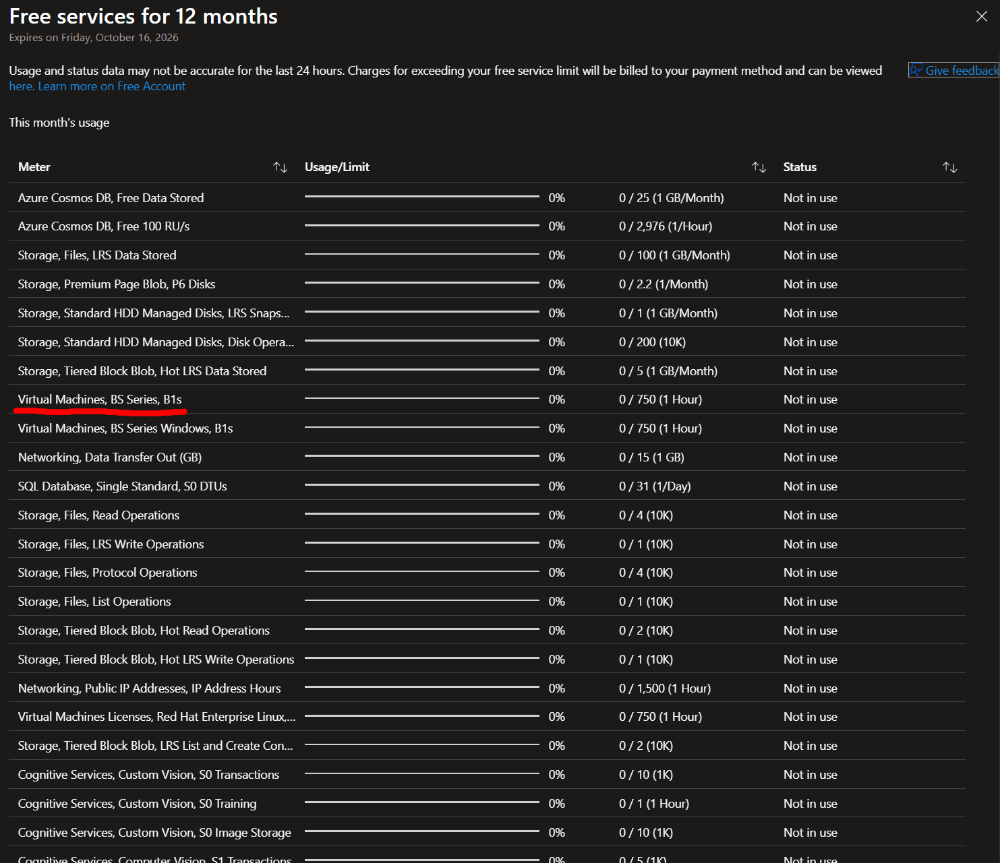

# why i switched from vms to aca express

> [!NOTE]
> for those of you who don't have an azure student subscription, this one may be less relevant since the entire reasoning behind this post is based on Azure Student subscription benefits. additionally, the use case is purely application hosting, so the solution may not be applicable to you if you have another use case.

in my blog post [how i deployed an ai agent on my portfolio without going broke](https://aryxenv.dev/blog/how-i-deployed-an-ai-agent-on-my-portfolio-without-going-broke/), i mentioned, quote;

```text
with azure student sub you get multiple vms for free
```

while i did note that you may be charged extra for storage, networking and other add-ons, these add up. in this post, i'll go through why i was wrong about vms being the best option on an azure student sub, and what i came up with as a solution as a true near-zero-cost solution to host my applications.

## vms

when you look at the azure student subscription benefits of resources you can deploy and use, vms look the most attractive option for hosting your applications, since it says you have 750 hours of free compute (for certain vm types) per month, since a month has 730 hours, it looks like it's essentially free.

Until you start using it and quickly realize that while the compute is free, mandatory add-ons are not, and the worst part? even if no one is using your application, the meter is still running (fixed running costs).



let me show you my own costs of having my portfolio's backend running on a vm:

between september 6 and september 10, 2026, i ran a single `Standard_B1s` vm in `swedencentral` with a standard static public ip and an e4 standard ssd (32 gib) os disk before deleting it and migrating to aca express.

in just **4.3 days (~103.5 hours)**, it accumulated **€0.81** in fixed running costs:

| resource & meter                          | usage                        | cost      | share    |
| :---------------------------------------- | :--------------------------- | :-------- | :------- |
| **standard ipv4 static public ip**        | 104 hours                    | €0.45     | 55.5%    |
| **e4 standard ssd disk (32 gib storage)** | 4.3 days                     | €0.30     | 36.7%    |
| **e4 standard ssd disk operations**       | ~367,000 io transactions     | €0.06     | 7.8%     |
| **b1s compute (1 vcpu, 1 gib ram)**       | 103.3 hours (free tier)      | €0.00     | 0.0%     |
| **data transfer / egress**                | ~30 mb (free tier allowance) | €0.00     | 0.0%     |
| **total (4.3 days)**                      |                              | **€0.81** | **100%** |

at ~€0.19/day, this "free" vm would cost **~€5.64/month**, which is quite close to my estimation in [how i deployed an ai agent on my portfolio without going broke](https://aryxenv.dev/blog/how-i-deployed-an-ai-agent-on-my-portfolio-without-going-broke/), where i estimated it would cost ~€5/month.

- **€0.00 for compute** (the 750 free hours benefit works as advertised).
- **€3.13/month for the static public ip** (a mandatory requirement to reach the vm from the public internet).
- **€2.06/month for disk capacity** (azure free tier does not grant free standard ssds, which is the portal default).
- **€0.45/month for idle disk i/o** (even with 0 users, linux background services generate ~50k–100k disk ops/day).

## aca express

when i switched to azure container apps on september 10, the picture changed completely:

over the remaining 20 days of september, the backend cost **€0.04 in total** (~€0.002/day):

- no static public ip fees (aca provides managed ingress and https out of the box).
- no provisioned disk fees (stateless containers use ephemeral storage).
- scales to zero when idle, fitting comfortably into aca's free monthly grants.

but what's the catch? you can't just cut hosting costs by **99%** and expect zero drawbacks.

the answer is, there is no catch, it runs exactly the same.

how? there's a **hidden per-account benefit**, kind of like cosmos db offering 25gb of storage with 1000 ru/s throughput for free. it's just way less obvious here because it isn't clearly advertised when creating a container app. in your azure subscription, you get 180k vcpu-seconds, 360k gib-seconds (memory) and 2 million requests per month for free, which is more than enough to host multiple personal projects.

it's important to also set the **min-replica count to 0**, so that when there are no requests, the container app scales down to 0 and you don't pay for idle compute, making it much harder to hit the free tier limits. and the best part? since we are using aca express, the **cold starts are almost non-existent**, so you don't have to worry about the first request being slow. this makes a zero-drawback solution to hosting your applications (and doesn't even require azure student sub benefits).

## migration

i applied this migration to both my portfolio's backend and another project that was running on a vm ([nnue chessbot](https://aryxenv.dev/nnue-chessbot/)), which is a whole neural network chess engine backend. the migration was free too, since i let geminii 3.8 flash handle is on antigravity, which it did without any issues, practically one-shot.

but there were some limitations that i had to address during the migration

### limitation #1: no system managed identity

aca express currently does not support system managed identities, making entra id based auth more complicated than system-to-system auth within azure. luckily, **it does support user managed identities**, adding this added zero extra costs, but did require a little bit of extra work to set up.

### limitation #2: dockerfiles & container registries

since aca is still a container-based service, you need to provide a dockerfile for your application, which i did not have since i deployed it on a vm where it was not necessary. it was quite straightforward and didn't take much time, on the bright side, adding a dockerfile for deployment is good practice, so i consider this a win-win situation.

the only downside here was that i needed a registry to host the docker image on, azure container registry (acr) would be the easiest option, but it would have added extra costs, so i opted for **github container registry** (ghcr.io) instead, which is free for public repos (with generous limits for private repos).

### minor changes

since the ci/cd was set up for a vm, i had to change this to accomodate the new aca express deployment, i let the agent handle this one entirly which it did and tested without any errors.

lastly, the endpoint needed to change from the vms public endpoint to the aca express' public endpoint, this was a simple change in the frontend code.

### cleanup

to round of the migration i also obviously had to **delete all vm resources** to make sure i wasn't paying for them anymore, i let an agent handle the entire teardown and simply reviewed if everything was deleted correctly, which it was.

## results

i saw a **99% reduction in hosting costs** for my applications, and up to this day i have had no issues at all, the cold starts are practically unnoticeable, and the applications run exactly the same as they did on a vm. the migrations were a success and i will definitely continue to use aca express to host my personal applications (also great timing since my student subscription is ending in a few days!), and i would recommend it to anyone looking for a zero-cost solution to host their applications on azure.

## references

- [how i deployed an ai agent on my portfolio without going broke](https://aryxenv.dev/blog/how-i-deployed-an-ai-agent-on-my-portfolio-without-going-broke/)
- [portfolio - backend is handling agent requests](https://aryxenv.dev/)
- [nnue chessbot - backend is handling agent and neural network](https://aryxenv.dev/nnue-chessbot/)
- [azure student subscription benefits](https://azure.microsoft.com/en-us/free/students/)
- [azure container apps pricing](https://azure.microsoft.com/en-us/pricing/details/container-apps/)
- [azure virtual machines pricing](https://azure.microsoft.com/en-us/pricing/details/virtual-machines/)
- [azure container registry pricing](https://azure.microsoft.com/en-us/pricing/details/container-registry/)
- [azure user managed identities](https://learn.microsoft.com/en-us/azure/active-directory/managed-identities-azure-resources/overview)
